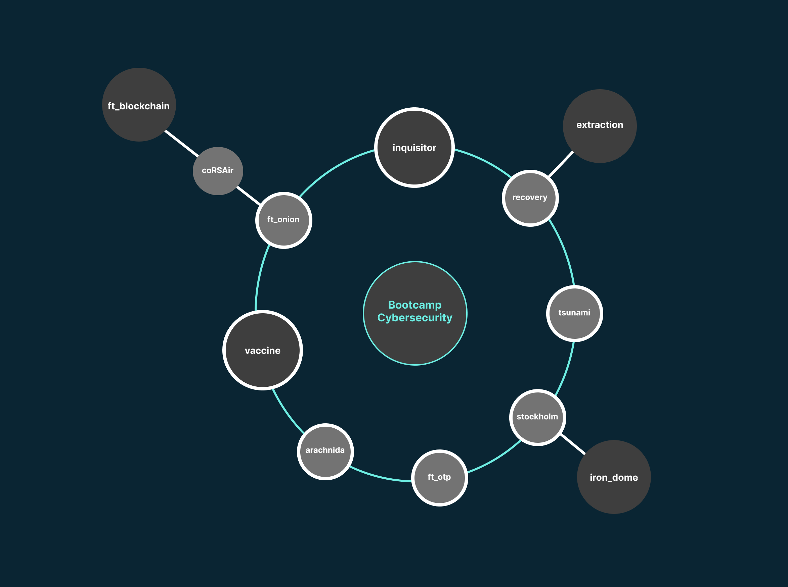

<h1>CybersecurityBootcamp42</h1>
<h3>A compilation of projects</h3>
These are diferent projects themed on cybersecurity, each one of them has its own PDF showing the requirements in order to archive the desired result.
On the following graph you will be able to see the projects that were able.

At that time we worked as a team some 42 students, the main programing lenguage was Python as well as some C and Shell.
